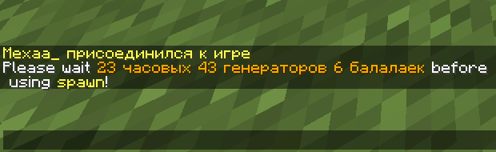
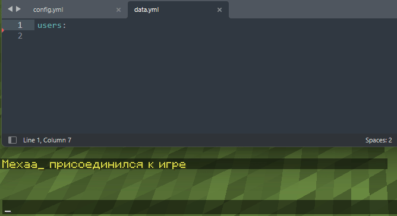

# MEXCooldowns
[Discord](https://discord.gg/ezKDWxpkzh) • [VK](https://vk.com/mexaas) • [SpigotMC.ru](https://spigotmc.ru/members/mexaa_.79484/#about) • [SpigotMC.org](https://www.spigotmc.org/members/mexaa_.1196753/) • [Modrinth](https://modrinth.com/user/Mexaa_)

MEXCooldowns is a **powerful and user-friendly plugin** for managing command cooldowns on your Minecraft server. It allows you to **easily create** and **configure cooldowns for any command,** as well as fully control their display and behavior for different player groups.

Plugin supports:
- 💾 **Fully customizable config,** allowing you to change prefixes, messages, and cooldown parameters.
- 🤖 **Flexible time formatting:** seconds, minutes, hours, days.
- 🔒 **Full LuckPerms integration:** the plugin automatically detects the player's priority group and applies the corresponding settings.
- 🛸 **Ability to bypass restrictions** for specific groups using the bypass setting.
- 📲 **Easy plugin management** and reloads without errors.
- 💻 **High optimization:** data is stored in a fast runtime mode and only saved to data.yml on shutdown.
---
# ⬇️ Installation
1. Download the latest version of MEXCooldowns from [Releases](https://github.com/Mexaas/MEXCooldowns/releases/tag/1.0.1), [Modrinth](https://modrinth.com/plugin/mexcooldowns), [SpigotMC.ru](https://spigotmc.ru/resources/mexcooldowns-gibkie-kuldauny-komand-s-podderzhkoj-luckperms.4916/) or [SpigotMC.org](https://www.spigotmc.org/resources/%E2%8C%9B-mexcooldowns-%E2%80%94-flexible-command-cooldowns-with-luckperms-support-%E2%9A%99%EF%B8%8F.132108/)
2. Place the downloaded JAR file into your server's `plugins` folder.
3. Start or ` restart your server ` to generate the default configuration files.
4. Customize the `config.yml` and `data.yml` files located in the `plugins/MEXCooldowns ` folder to suit your needs.
---
# ⚙️ Screenshots

Simple command: ` /mexc reload ` for your plugin. ` Prefix ` can be changed in plugin config

Default ` config.yml ` messages can be changed to your own style

Default permission for reload: ` mexcooldowns.reload `

Change time format in ` config.yml `, how you want

In ` runtime mode ` plugin works faster and saves data only on server shutdown at ` data.yml `. After starting the server, all information from ` data.yml ` will load into the plugin's memory for quick access. It makes plugin more optimized

